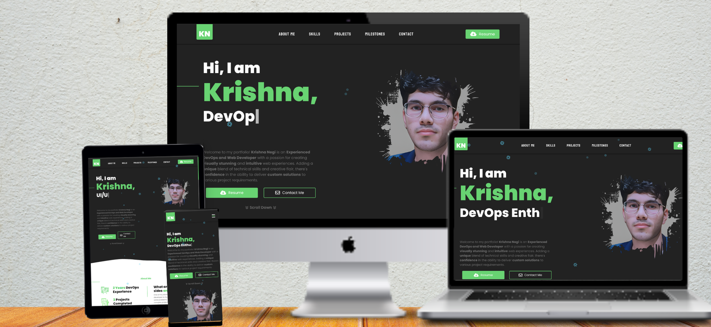

  <h1 align="center">Personal Website</h1>
  <h5 align="center">HTML5 + CSS3 + JavaScript</h5>
  

  
  

  

_Call-to-Action buttons_

_Repo info_

## Languages Used

## Documentation

## License

Released under [MIT](/LICENSE) by [@krishna](https://github.com/krishna-negi05).
